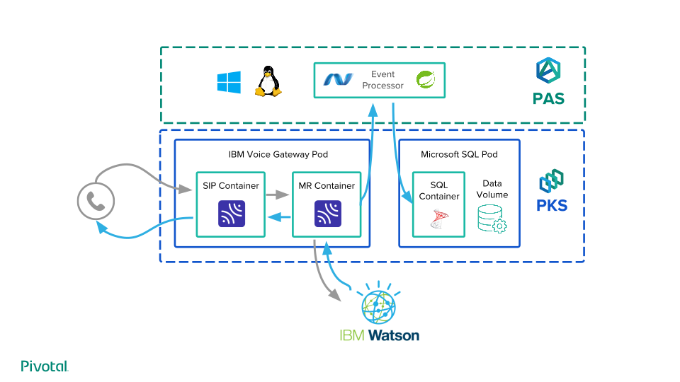

# Automated Teller Via Pivotal Cloud Foundry

## General Architectural Overview:

## Location of components:

- All slides and content for presenting this project is located under resources.
- The components for deploying the IBM Voice Gateway can be found under ibm-voicegateway-pks
- The components for deploying the Microsoft SQL Server can be found under mssql-server-pks
- The components for deploying our event processors (both .NET Framework + Spring) can be found under event-processor

